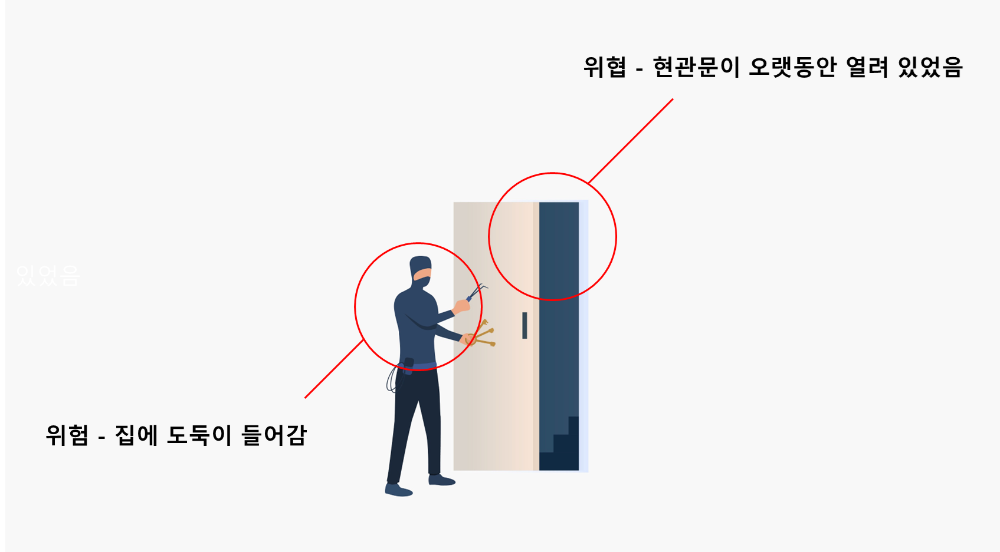
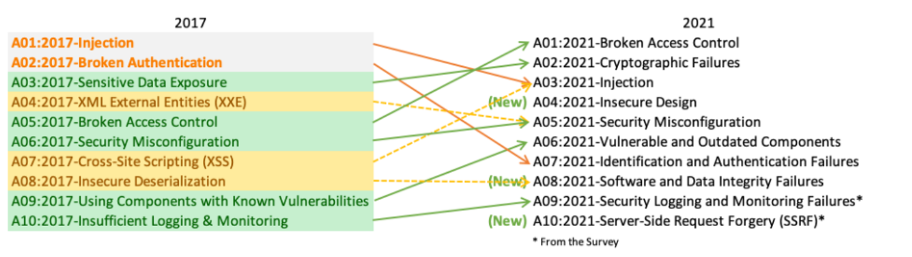
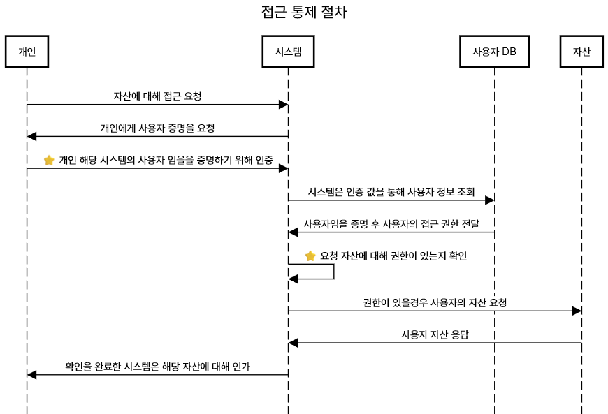

# 안전한 웹 서비스를 운영하는 방법

웹 서비스 개발이 끝난 후 배포를 시작하면 외부로 부터 오는 해킹 공격이 시작됩니다. 과연 우리가 만든 앱이 이용자들에게 안전하게 서비스를 제공하고 있는지 증명하려면 어디서부터 시작해야 할까요? 

이 글은 안전한 웹 서비스를 개발하기 위해 알아야 할 기본 지식들을 소개합니다.

## 웹 어플리케이션과 보안
보안(Security)이란 무엇일까요? 옥스포드 사전에서 아래와 같이 정의되어 있습니다.

> the state of being free from danger or threat.

적을 알고 나를 알면 백전백승이란 말이 있듯이 보안을 알기 위해선 위험과 위협에 대해서 알아야 합니다.

#### 위험(Danger)과 위협(Threat) 

**위험**의 정의는 여러가지지만 주로 **발생하면 좋지 않은 일을 의미**합니다. 예를 들어, 내 집에 도둑이 들어 노트북을 훔처가 버린 상황을 생각해봅니다. 여기서 위험은 도둑이 들어 물건을 훔처간 것을 의미 하고 노트북을 잃게 된 것이 실제 위험이 현실로 작용된 것입니다.

그럼 **위협**은 무엇일까요? 위협이란, 위의 **도둑이 들 수 있는 위험에 대한 원인**입니다. 현관문을 열어놓고 장시간 집을 방치하는 것, 현관문 비밀번호가 기본 비밀번호인 것, 현관문 열쇠를 카페트나 화분 뒤에 넣는 것과 같이 위험을 일으킬 수 있을만한 가능성입니다.

<p></p>

안전한웹 서비스를 개발하기 위해선 서비스에서 발생할 수 있는 위험과 위협을 식별하고 이를 안전하게 관리해야 합니다. 하지만 초보 웹 개발자는 어디서부터 시작해야 할지 감이 오질 않습니다.

그럼 지금부터 웹 어플리케이션엔 어떤 위협과 위험이 있는지 살펴보도록 하겠습니다.

### 웹 어플리케이션 위협과 위험

<p></p>

웹 어플리케이션의 위협과 위험이 어떤 것들이 존재하는지 파악하기 좋은 사이트는 [OWASP Top 10](https://owasp.org/www-project-top-ten/)입니다. 자주 발견되는 위험이거나, IT 트렌드에 따라 중요한 보안 위협 10개를 4년마다 발표하기 때문입니다. 최근에 나온 top 10은 2024년 기준 2021년이고 어떤 위험에 관심을 가져야 하는지 살펴보겠습니다.

#### OWASP Top 10

<p></p>

왼쪽은 지난 4년에 제일 중요했던 상위 10개의 위험이고 오른쪽은 현재 중요한 상위 10개의 위험입니다. 왼쪽에 있는 위험 카테코리가 분리되기도 하고 새로 합쳐지거나 새로운 카테고리가 만들어지기도 하는 것이 OWASP Top 10의 특징입니다.

2021년에 발표한 제일 위험한 위험은 [A01:2021-Broken Access Control](https://owasp.org/Top10/A01_2021-Broken_Access_Control/) 입니다. OWASP에 설명하는 이 위험에 대한 설명은 아래와 같습니다.

> Access control enforces policy such that users cannot act outside of their intended permissions. Failures typically lead to unauthorized information disclosure, modification, or destruction of all data or performing a business function outside the user's limits.

요약하자면 개발자가 정의한 접근 권한 검증이 실패하여 악의적인 이용자가 권한이 없는 정보를 유출, 변조 또는 삭제하는 위험입니다.

Broken Access Control은 OWASP 가 선정한 제일 심각한 위험 이기 때문에 이 글에선 어떻게 이 위험을 막기 위한 기초 지식을 소개하겠습니다.

### 접근 통제

Access Control(접근 통제)를 올바르게 적용 하기 위해선 접근 통제의 원리를 알아야 합니다. 접근 통제를 적용하기 위한 요소는 크게 4가지가 필요합니다. 자산, 인증, 인가 그리고 권한입니다. 
시스템은 아래의 절차를 거쳐 접근 통제를 합니다.

<p></p>

위의 접근 통제에서 제일 중요한 2가지 요소인 인증과 권한에 대해서 구체적으로 설명 드리겠습니다.

#### 인증

인증(Authentication)이란, 위의 접근 통제 절차에서 봤듯이 시스템에 접근하려는 사람이 자신의 해당시스템의 사용자임을 증명하는 과정을 의미합니다. 인증을 하는 방법은 크게 4가지로 구분됩니다.

- **무언가 알고 있는 것 (Something You Know)**: 비밀번호, PIN, 보안 질문 등의 사용자가 기억하고 있는 정보를 활용하는 방식입니다.
- **무언가 가지고 있는 것 (Something You Have)**: 스마트폰, OTP 토큰, 보안 카드와 같이 사용자가 소지하고 있는 물리적인 장치를 사용하는 방법입니다.
- **무언가 자신인 것 (Something You Are)**: 지문, 얼굴 인식, 홍채 인식과 같은 생체 정보를 활용한 인증 방식입니다.
- **어디에 있는지 (Where You Are)**: 사용자의 위치 정보를 활용하여 인증을 수행하는 방법입니다. 주로 GPS나 IP 주소 등을 활용합니다.

위의 4가지 중 1개만 사용하거나 좀 더 보안을 강화하기 위해 2가지 이상의 인증 방법을 조합하여 사용하는 멀티 팩터 인증 방식도 있습니다. 대표적으로 비밀번호와 OTP를 조합해 인증을 합니다.

#### 권한

권한(Authorization)은 사용자가 인증을 완료한 후, 시스템 내에서 특정 리소스에 대한 접근 또는 작업에 범위에 관한 정의입니다.  즉, 사용자가 누구인지를 확인한 후 그 사용자가 수행할 수 있는 동작의 범위를 정의하고 제어하는 단계입니다. 권한은 대표적으로 **생성, 조회, 수정, 삭제** 과 같은 동작이 있습니다.

###  접근 통제 구현

스프링부트에선 어떻게 구현할 수 있는지 간단한 어플리케이션을 구현해보겠습니다. 아래의 API를 구현한다고 가정합니다.

| Method | URI            | 설명                                 |
| ------ | -------------- | ---------------------------------- |
| POST   | /login         | 시스템에 접근하기 위한 인증을 수행합니다.            |
| GET    | /resource/{id} | 인증이 완료된 사용자에게 리소스를 볼 수 있는 권한을 줍니다. |

#### 잘못된 사례 : 권한이 같은 사용자들 끼리 접근 통제를 하지 않는 경우

`GET /resource/{id}`를 할 때 접근 권한을 검증하지 않으면 어떻게 될까요? 
아래의 예제는 ArgumentResolver로 인증 토큰을 통해 인증을 성공했음을 가정한 상태에서 API를 요청하는 예제입니다.

``` java
// controller

class Controller {
	@GetMapping("/resource/{id}")
	ResponseEntity<ResourceResponse> getResource(Long resourceId,Member member) {
		// controller에서 인가된 사용자임을 검증했으니 서비스에선 접근 권한을 검증하지 않아도 되겠지?
		ResourceResponse resonse = service.findByResourceId(resourceId);
		return ResponseEntity.ok()
	}
}

// service
class Service {
	ResourceResponse findByResourceId(Long resourceId) {
		// 서비스 로직에서 resourceId에 대한 자원만 얻으려고 한다.
		Resource resource = resourceRepository.findById(resourceId);
		return new ResourceResponse(resource);
	}
}
```

앞에서 인증을 통해 개인이 해당 시스템에 접근할 수 있는 사용자임을 검증에 성공했지만, 서비스 로직에서 리소스 소유자를 검증하지 않기 때문에 로그인 한 회원이 다른 회원의 리소스를 조회할 수 있는 위험이 발생하게 됩니다. 이것이 위에서 설명한 Broken Access Control 의 주요 원인입니다. 그렇다면 이런 문제를 어떻게 해결해야 할까요? 

#### 대응 방법: 접근하고자 하는 리소스의 소유자 인지 검증한다.

간단합니다. 리소스의 소유자를 검증하면 됩니다. 아래는 예제 코드입니다.

``` java
class Service {
	ResourceResponse findByResourceId(Long resourceId, Member member) {
		// 인가된 사용자가 해당 리소스의 소유자인지 검증한다.
		Resource resource = resourceRepository.findByIdAndMember(resourceId, member);
		return new ResourceResponse(resource);
	}
}
```

이렇게 해당 리소스가 소유자인지 확인하기 위해 연관 된 사용자 정보와 함께 조회하게 되면 안전하게 소유하고 있는 리소스만 조회할 수 있게 됩니다. 접근 통제에 대해 고민할 땐 이 처럼 같은 권한이 있는 사용자끼리 어느 범위까지 자원을 허용해야 할 지 고려해야 합니다.
